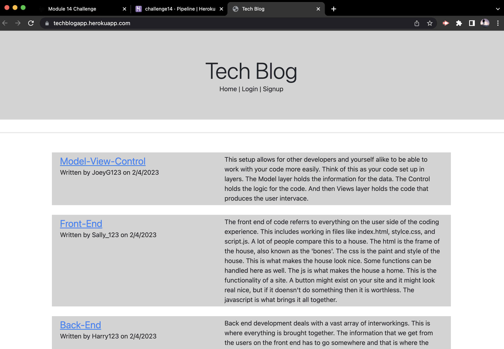

# challenge_14 - MVC Challenge: Tech Blog

## Description 
This challenge was built from scratch and uses mySQL, Sequelize, bcrypt, and handlebars to put everything together - from front end to back end.

## Instructions
To run this application you must have all the code. Then, open the command line, start mysql, run the schema, seed the created database and start the application. 

## Screen Shots
The following shows the deployed application on Heroku: 

## Link
This [link](https://www.heroku.com) will take you to the depolyed application on Heroku.